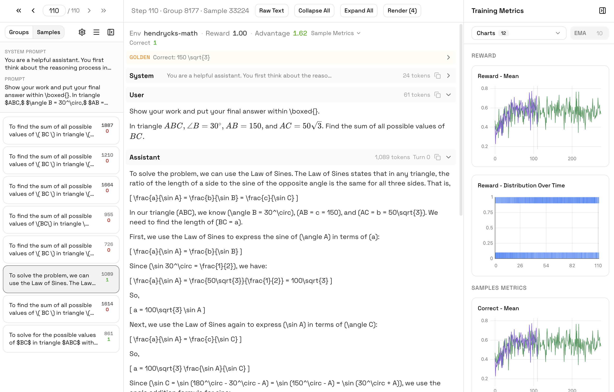

<p align="center">
  <picture>
    <source media="(prefers-color-scheme: dark)" srcset="assets/logo-full-dark.svg">
    <source media="(prefers-color-scheme: light)" srcset="assets/logo-full.svg">
    
  </picture>
</p>

<p align="center">
  A framework for post-training LLMs with reinforcement learning for reasoning and agents.
</p>

# Telescope

Telescope provides a training engine and a visualization dashboard. The training engine coordinates an orchestrator, vLLM inference servers, and a trainer (FSDP or Megatron) across GPUs on a Ray cluster. The [visualization dashboard](https://docs.telescope.training/visualization/installation) connects to your Weights & Biases runs and provides real-time monitoring of training metrics, rollout inspection, GPU timeline visualization, infrastructure metrics, and evaluation results.

Full documentation at [docs.telescope.training](https://docs.telescope.training).

https://github.com/user-attachments/assets/238e3571-3d43-486d-a13f-064f9f107b23

## Installation

### Docker (recommended)

```bash
docker pull ghcr.io/eduardoslonski/telescope:latest

docker run --rm --gpus all --ipc=host --shm-size=16g \
  --ulimit memlock=-1 --ulimit stack=67108864 --ulimit nofile=65536:65536 \
  -it ghcr.io/eduardoslonski/telescope:latest /bin/bash
```

On GPU cloud platforms like Vast.ai and RunPod, you can create a custom template with the image `ghcr.io/eduardoslonski/telescope:latest` — they handle the rest. On Lambda, CoreWeave, and similar VM-based platforms, Docker comes preinstalled so you can pull and run the image directly.

### From source

Requires NVIDIA GPU(s), Python 3.11+, and [uv](https://docs.astral.sh/uv/).

```bash
git clone https://github.com/eduardoslonski/telescope.git
cd telescope

uv venv --python 3.11
source .venv/bin/activate
uv sync
```

## Quickstart

Log in to Weights & Biases (used for metrics and the visualization UI):

```bash
wandb login
```

Run training with an example config:

```bash
uv run train.py --config configs/examples/example_countdown.yaml
```

This trains Qwen2.5-3B on the Countdown task — creating equations from numbers to reach a target value — using GRPO with 2 inference workers and 2 trainer workers (4 GPUs). Adjust `trainer_num_workers` and `inference_num_workers` to match your setup.

You can override any config parameter from the CLI:

```bash
uv run train.py --config configs/examples/example_countdown.yaml \
  --learning_rate 5e-7 \
  --number_of_steps 500
```

### Visualization

```bash
pip install telescope-ui
telescope
```

Opens the dashboard at `localhost:8005`, syncing data from your W&B runs. See [UI documentation](https://docs.telescope.training/visualization/installation).

<p align="center">
  
</p>

## Examples

| Example                                                                                           | Task                                            | Type        | Extra deps                              |
| ------------------------------------------------------------------------------------------------- | ----------------------------------------------- | ----------- | --------------------------------------- |
| [`example_countdown.yaml`](configs/examples/example_countdown.yaml)                               | Create equations from numbers to reach a target | Single-turn | None                                    |
| [`example_hendrycks_math.yaml`](configs/examples/example_hendrycks_math.yaml)                     | Competition-level math problems                 | Single-turn | `uv add math-verify`                    |
| [`example_hendrycks_math_with_eval.yaml`](configs/examples/example_hendrycks_math_with_eval.yaml) | Math training with periodic evals               | Single-turn | `uv add math-verify`                    |
| [`example_wordle.yaml`](configs/examples/example_wordle.yaml)                                     | Multi-turn interactive word game                | Multi-turn  | `uv add textarena`                      |
| [`example_i3_code.yaml`](configs/examples/example_i3_code.yaml)                                   | Code generation with sandboxed tests            | Single-turn | Sandbox provider (`uv add daytona-sdk`) |

```bash
uv run train.py --config configs/examples/<example>.yaml
```

## Architecture

Telescope coordinates three main components to run RL post-training: the **orchestrator**, the **training engine**, and the **inference engine**. All components run on a [Ray](https://docs.ray.io/) cluster, which handles resource allocation and placement across GPUs.

Everything starts from a config file that sets up the model, algorithm, worker counts, and the environments to train on. The orchestrator loads the environment datasets and begins sending prompts to the inference engine, which generates completions using vLLM. As completions come back, the orchestrator calls the environment's reward function to score each one. Once enough scored samples accumulate into a full training batch, the orchestrator sends it to the trainer, which runs a gradient step with the configured RL algorithm and broadcasts the updated weights back to the inference engine.

Neither side waits for the other — the inference engine keeps generating as long as the orchestrator feeds it prompts, and the trainer keeps training as long as there are batches ready. This overlap is what makes Telescope efficient.

See [Architecture](https://docs.telescope.training/training/architecture) for more details.

## Features

- [**Async training**](https://docs.telescope.training/training/async-training) — inference and training run concurrently on separate GPU pools, eliminating idle GPU time. Controlled by `max_async_rollout`.
- [**7 RL algorithms**](https://docs.telescope.training/training/algorithms) — GRPO, RLOO, REINFORCE++, DR-GRPO, CISPO, GSPO, SAPO, all combinable with PPO clipping.
- [**FSDP and Megatron backends**](https://docs.telescope.training/training/architecture) — FSDP (data parallel) for models up to ~14B. Megatron for 14B+ with tensor, pipeline, context, and expert parallelism.
- [**Environments**](https://docs.telescope.training/training/environments) — single-turn and multi-turn environments with auto-discovery. Create a folder under `src/telescope/environments/` and it's ready to use.
- [**Reward design**](https://docs.telescope.training/training/reward-design) — multi-component rewards with per-environment normalization via `reward_min`/`reward_max`.
- [**Tool calling**](https://docs.telescope.training/training/tool-calling) — built-in support for agentic training with tool use, a `ToolEnvironment` base class, and pluggable sandbox execution (Prime, Modal, Daytona, E2B).
- [**Evals**](https://docs.telescope.training/training/evals) — periodic evaluations on dedicated servers during training, plus a standalone eval driver for saved checkpoints.
- [**Checkpointing**](https://docs.telescope.training/training/checkpointing) — periodic saves with configurable retention, resume from any checkpoint, and HuggingFace format conversion.
- [**Multi-node training**](https://docs.telescope.training/training/multi-node) — start a Ray cluster across nodes and run training normally. Supports PACK/SPREAD placement strategies.
- [**Performance tuning**](https://docs.telescope.training/training/performance) — sequence packing, prompt prefetch, individual sample lanes, stale rollout cancellation, truncated importance sampling, and zero-advantage filtering.
- [**Visualization**](https://docs.telescope.training/visualization/installation) — companion dashboard (`pip install telescope-ui`) with real-time metrics, rollout inspection, GPU timeline, infrastructure monitoring, and eval results.
- [**Configuration**](https://docs.telescope.training/training/config) — three-layer config system (defaults → run config → CLI overrides). See [`configs/defaults/default_train.yaml`](configs/defaults/default_train.yaml) for the full parameter reference.

## Next

- Agent training focus
- Sandbox observability
- Fault tolerance
- Better inference scheduling and cache management (vLLM internals)
- Context compaction
- Long-horizon reasoning
- Advanced agent capabilities (computer use, browser use, etc. with good performance and observability)
